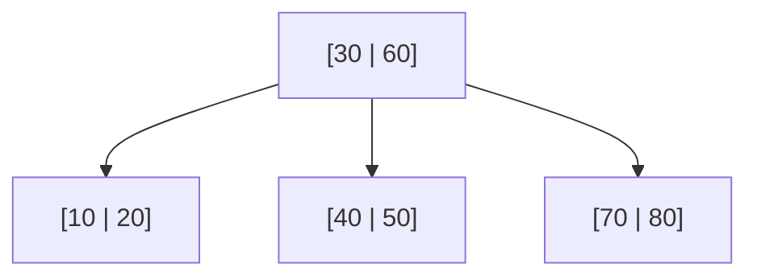

## B+ Tree Basics

Most relational databases rely on B+ trees for efficient lookup.

- Internal nodes route by key
- Leaf nodes store pointers to data
- Depth remains low at large scale



## Index Types

| Type      | Description |
|:----------|:------------|
| Primary   | Clustered key index |
| Unique    | Enforces uniqueness |
| Composite | Multi-column optimization |

## Leftmost Prefix Rule

```sql
-- index (a, b, c)
SELECT * FROM t WHERE a = 1;
SELECT * FROM t WHERE a = 1 AND b = 2;
SELECT * FROM t WHERE b = 2; -- usually misses index
```
