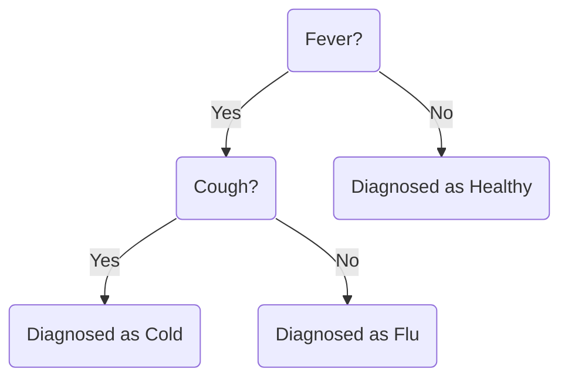

> Welcome to my blog.

## Test Content

### Image


### Code Block

```python
if __name__ == "__main__":
    print("Hello World")
```

### Formula

$$
f(x) = \frac{1}{\sqrt{2\pi\sigma^2}} \exp\left(-\frac{(x - \mu)^2}{2\sigma^2}\right)
$$

Where:

- $\mu$ is the mean
- $\sigma$ is the standard deviation
- $\sigma^2$ is the variance

### Table

| X | Y | Z  |
|:--|--:|:--:|
| 0 | 0 | -1 |
| 0 | 1 | +1 |
| 1 | 0 | +1 |
| 1 | 1 | -1 |

### Mermaid

