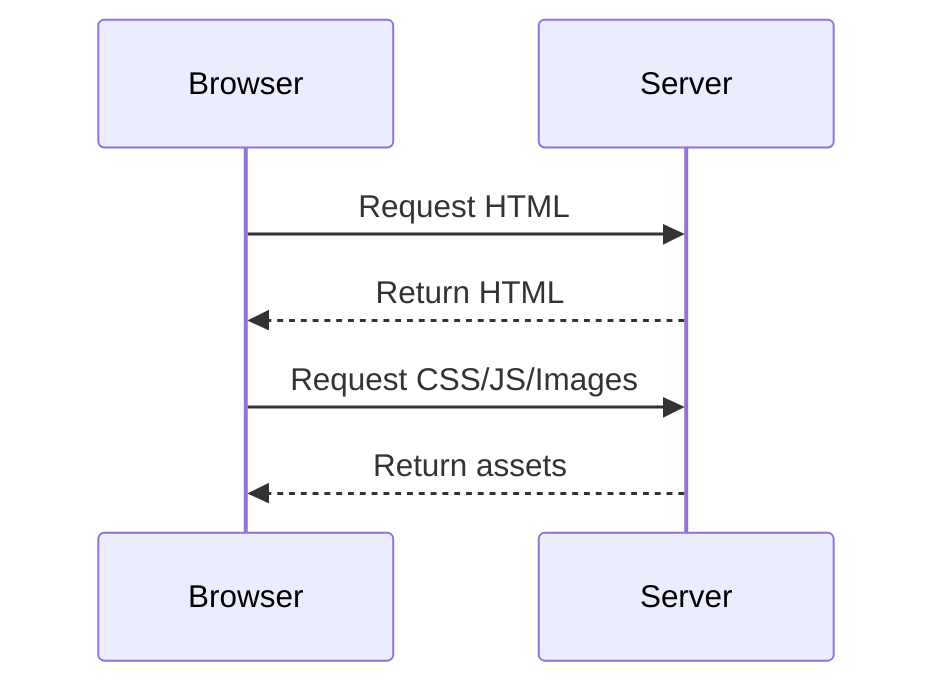

## Critical Rendering Path

1. Parse HTML and CSS
2. Build render tree
3. Layout and paint

## Resource Loading

```html
<link rel="preload" href="/fonts/main.woff2" as="font" crossorigin>
<script src="app.js" defer></script>
```

## Image Strategy

| Practice          | Benefit |
|:------------------|:--------|
| Use WebP/AVIF     | Smaller assets |
| Set width/height  | Lower CLS |
| Lazy load images  | Faster initial render |


