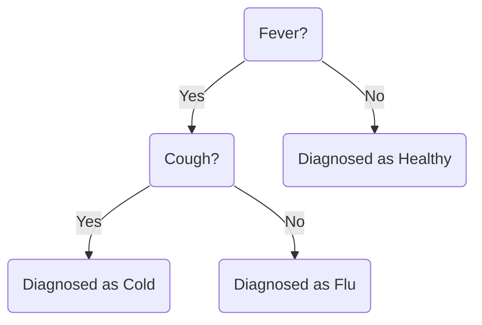

>Welcome to my blog!

---

# Test Content

## Image


## Code Block

```python
if __name__ == "__main__":
    print("Hello World!")
```
## Formula
**Probability Density Function of the Normal Distribution**

$$
f(x) = \frac{1}{\sqrt{2\pi\sigma^2}} \exp\left(-\frac{(x - \mu)^2}{2\sigma^2}\right)
$$

Where:

- $ \mu $ is the mean (expected value)  
- $ \sigma $ is the standard deviation  
- $ \sigma^2 $ is the variance  

**Matrix**

$$\begin{bmatrix}
1 & 0 & 0 \\
0 & 1 & 0 \\
0 & 0 & 1 \\
\end{bmatrix}$$

## Table

| X | Y | Z  |
|:--|--:|:--:|
| 0 | 0 | -1 |
| 0 | 1 | +1 |
| 1 | 0 | +1 |
| 1 | 1 | -1 |

## Mermaid

